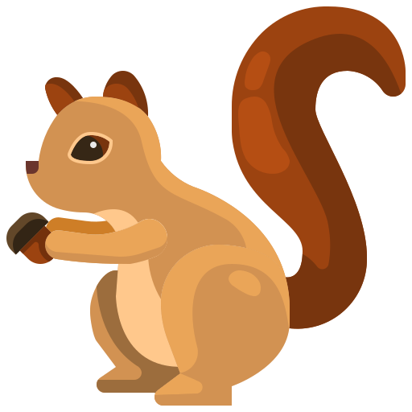
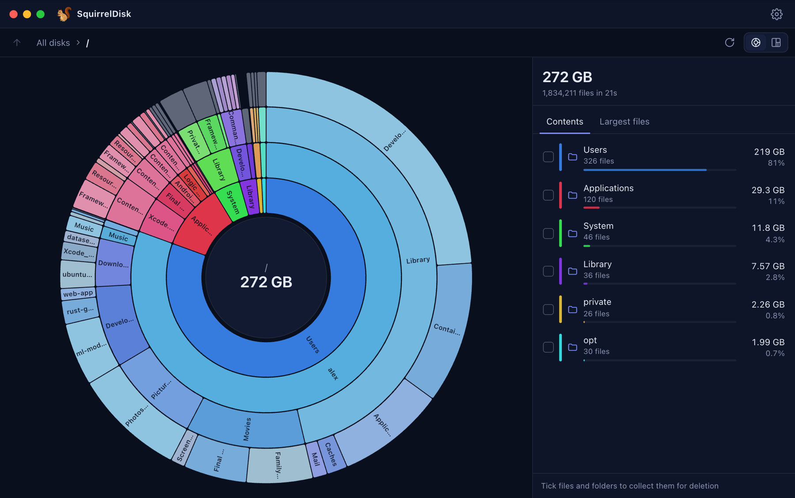
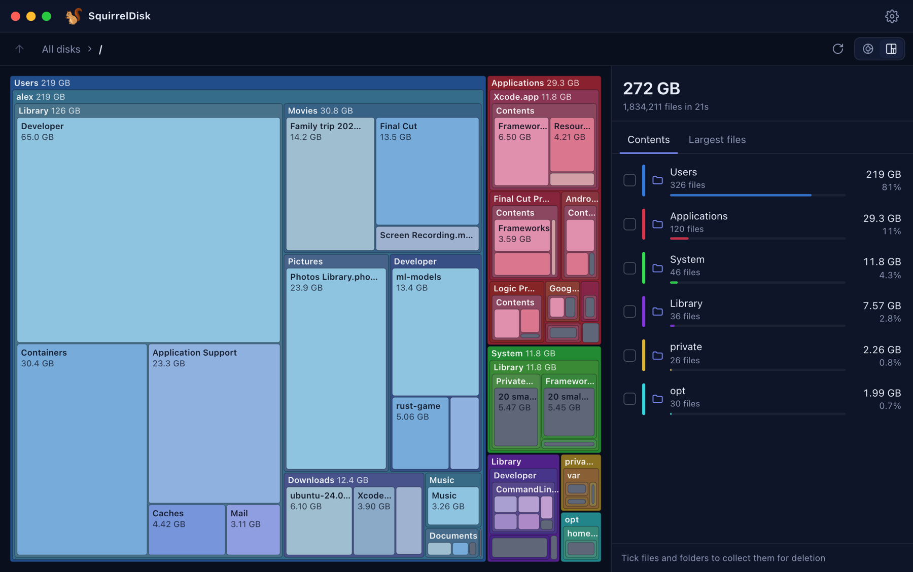
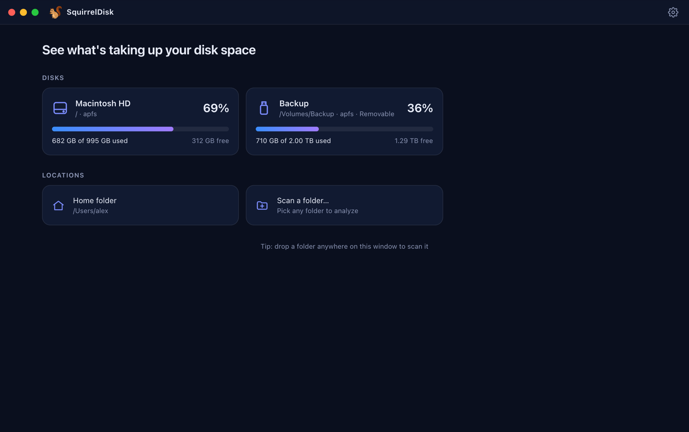
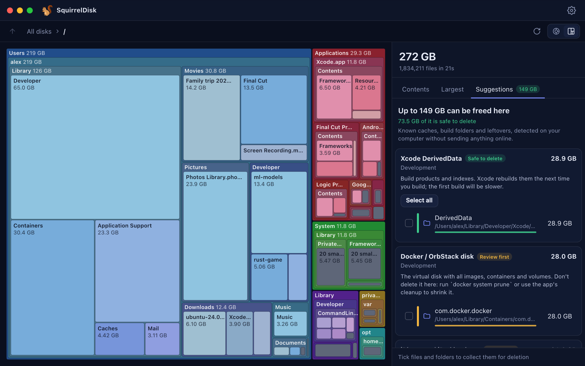

<p align="center">
  
</p>

<h1 align="center">SquirrelDisk – free disk space analyzer</h1>

<p align="center">
  <strong>See what's taking up your disk space.</strong><br />
  A fast, open source disk usage analyzer for macOS (Apple Silicon and Intel), Windows and Linux.<br />
  <a href="https://hernancasillas.github.io/squirreldisk/"><strong>Website</strong></a> ·
  <a href="https://github.com/hernancasillas/squirreldisk/releases/latest"><strong>Download</strong></a> ·
  <a href="https://hernancasillas.github.io/squirreldisk/es/">Español</a>
</p>

<p align="center">
  <a href="https://github.com/hernancasillas/squirreldisk/releases/latest"></a>
  <a href="https://github.com/hernancasillas/squirreldisk/actions/workflows/ci.yml"></a>
  
  
</p>



<p align="center">
  
  
</p>

<p align="center">
  
</p>

SquirrelDisk shows what's taking up space on your disk and helps you free it. Pick a disk or folder, and an interactive sunburst or treemap shows where the space went. The Suggestions tab points out caches and build folders you can safely delete, such as Xcode DerivedData, `node_modules`, Gradle caches and the Adobe media cache. Collect what you don't need and move it to the Trash in one go.

It is a free, open source alternative to **DaisyDisk**, **GrandPerspective** and **OmniDiskSweeper** on macOS, **WinDirStat**, **WizTree**, **TreeSize** and **SpaceSniffer** on Windows, and **Baobab** and **QDirStat** on Linux.

This is a maintained fork of [adileo/squirreldisk](https://github.com/adileo/squirreldisk), which stopped receiving updates in 2023. Most of the app was rewritten. The main goal was to make it run natively on Apple Silicon and to fix the scans that hung at 100%. The [changelog](CHANGELOG.md) lists every upstream issue it closes.

## Features

- **Native on every platform.** A universal macOS build runs natively on M1/M2/M3/M4 and Intel. Windows and Linux builds are for x86_64, and Linux also has arm64.
- **Fast, in-process scanner.** It scans on all cores and reports live progress. You can cancel at any time. It no longer depends on an external `pdu` binary.
- **Accurate sizes.** Sizes are what files really use on disk. Sparse files, such as Docker, OrbStack and VM images, no longer show as terabytes. Cloud placeholders from iCloud, Dropbox and OneDrive count only what is stored locally. Hard links are counted once.
- **No double counting on macOS.** The APFS data volume is reached through firmlinks and is counted once. The scan never enters other mounted volumes.
- **Sunburst and treemap views** with readable labels, hover tooltips, and one color legend shared with the file list.
- **"Largest files" tab** lists the biggest files anywhere inside the current folder.
- **Cleanup suggestions.** SquirrelDisk recognizes about 40 kinds of well-known caches and build folders: Xcode DerivedData, simulators, `node_modules`, package manager caches, Gradle, Adobe media cache, Final Cut render files, browser caches, iPhone backups and more. It explains what each one is and whether it's safe to delete or should be reviewed first, and it all runs on your computer.
- **Safe cleanup.** Tick files and folders, then move them to the Trash or Recycle Bin (you can also delete permanently). Nothing is deleted without confirmation, and the app only deletes items that are part of the scan.
- **Disk overview.** A bar shows scanned space, space the scan could not see (system, snapshots, purgeable) and free space.
- **Rescan a single folder** without scanning the whole disk again.
- **Excluded folders.** Skip folders you never want to scan.
- **Drag and drop** a folder onto the window, or run `squirreldisk /path/to/folder` from a terminal.
- **Keyboard shortcuts.** <kbd>Esc</kbd> or <kbd>Backspace</kbd> goes up one level. <kbd>Delete</kbd> (or <kbd>⌘ Backspace</kbd>) moves the selection to the Trash. <kbd>Shift + Delete</kbd> deletes it permanently.
- **7 languages:** English, Español, Português, Français, Deutsch, Italiano and 简体中文.
- **Automatic updates.** New versions install with one click. Every update is signed, and the app refuses any update that isn't. This works on macOS, Windows and Linux. For the portable Windows exe, download new versions manually.
- **Private.** No analytics or trackers. The only network request is the check for new releases on GitHub, which you can turn off in Settings.

## Install

Download the latest version from the [releases page](https://github.com/hernancasillas/squirreldisk/releases/latest).

### macOS (Apple Silicon and Intel)

1. Download `SquirrelDisk_x.y.z_universal.dmg`, open it and drag SquirrelDisk to Applications.
2. The app is open source but not notarized by Apple. The first time you open it, macOS says it can't verify the developer. Open **System Settings → Privacy & Security**, scroll down and click **Open Anyway**. You only do this once.

   Or run this command in Terminal:

   ```sh
   xattr -dr com.apple.quarantine /Applications/SquirrelDisk.app
   ```

3. Optional: give SquirrelDisk **Full Disk Access** (System Settings → Privacy & Security → Full Disk Access). Without it, macOS hides some protected folders from the scan. The app shows how many items it couldn't read, with a button that opens this setting.

### Windows

Download `SquirrelDisk_x.y.z_x64-setup.exe`. If you don't want to install anything, download `SquirrelDisk_x.y.z_x64_portable.exe`. The builds are not code-signed, so SmartScreen may warn you: click **More info → Run anyway**.

### Linux

Download the `.deb` (Debian/Ubuntu), `.rpm` (Fedora/openSUSE) or `.AppImage` for your architecture (`amd64`/`x86_64` or `arm64`/`aarch64`). The builds need WebKitGTK 4.1, which ships with Ubuntu 22.04+, Debian 12+, Fedora 36+ and newer distributions.

### Verify your download

Every release is built from source by [GitHub Actions](.github/workflows/release.yml). No binaries are committed to the repository. Each release includes `SHA256SUMS.txt` and a signed build provenance attestation. You can check any file with:

```sh
gh attestation verify SquirrelDisk_0.4.0_universal.dmg --repo hernancasillas/squirreldisk
```

## FAQ

**How do I find what's taking up space on my Mac?**
Open SquirrelDisk and click *Macintosh HD*. In about a minute you get a chart of every folder by size. Open the **Suggestions** tab to see caches you can delete safely.

**Is it safe to delete Xcode DerivedData?**
Yes. It only holds build products and indexes, and Xcode recreates it the next time you build. The same goes for `node_modules` (run `npm install` again), Rust `target` folders and Gradle caches.

**Does it run on M1, M2, M3 and M4 Macs?**
Yes. It's a universal app that runs natively on Apple Silicon and on Intel. It doesn't need Rosetta.

**Why does macOS say it can't verify the app?**
The app isn't notarized by Apple. Click **Open Anyway** in System Settings → Privacy & Security. You only do this once. See [Install](#macos-apple-silicon-and-intel).

**Is it free?**
Yes. It's open source (AGPL-3.0), with no ads, subscriptions or tracking.

## Build from source

Requirements: [Rust](https://rustup.rs) (stable), [Node.js](https://nodejs.org) 20+, and the [Tauri prerequisites](https://v2.tauri.app/start/prerequisites/) for your platform.

```sh
git clone https://github.com/hernancasillas/squirreldisk
cd squirreldisk
npm install
npm run tauri dev      # run in development mode
npm run tauri build    # build an installer for your machine
```

To build a universal macOS app:

```sh
rustup target add aarch64-apple-darwin x86_64-apple-darwin
npm run tauri build -- --target universal-apple-darwin
```

Run the tests:

```sh
npm test
cd src-tauri && cargo test
```

## How it works

The Rust backend (`src-tauri/src`) walks the file system in parallel with [rayon](https://github.com/rayon-rs/rayon) and keeps the whole tree in memory. The React frontend never receives the full tree. It asks for small, pruned views (the focused folder, a few levels deep, with tiny items folded into "smaller items"). This keeps the UI fast even for disks with millions of files. Deleting or rescanning a folder updates the tree in place.

| File | Purpose |
| --- | --- |
| `src-tauri/src/scan.rs` | Parallel scanner: allocated sizes, hard-link deduplication, mount and firmlink handling |
| `src-tauri/src/tree.rs` | In-memory tree, pruned views, largest files, removal and splicing |
| `src-tauri/src/lib.rs` | Tauri commands and events |
| `src/components/Sunburst.tsx`, `Treemap.tsx` | Charts (d3-hierarchy + React SVG) |
| `src/components/Results.tsx` | Results screen: list, selection, deletion, context menu |

## Contributing

Bug reports and pull requests are welcome. Please open an [issue](https://github.com/hernancasillas/squirreldisk/issues) with your OS version and steps to reproduce.

## Credits

- Original app by [Adileo Barone](https://github.com/adileo) and the [SquirrelDisk contributors](https://github.com/adileo/squirreldisk/graphs/contributors)
- Ideas from open upstream pull requests by [@citelao](https://github.com/citelao) (#65), [@peret](https://github.com/peret) (#54), [@mmalmi](https://github.com/mmalmi) (#66), [@ckindle-42](https://github.com/ckindle-42) (#59), [@PineappleRind](https://github.com/PineappleRind) (#18) and [@Roberto-deP-Martins](https://github.com/Roberto-deP-Martins) (#67)
- Built with [Tauri](https://tauri.app), [rayon](https://github.com/rayon-rs/rayon), [d3-hierarchy](https://github.com/d3/d3-hierarchy) and [trash-rs](https://github.com/Byron/trash-rs)

## License

[GNU AGPL-3.0](LICENSE), same as the original project.
